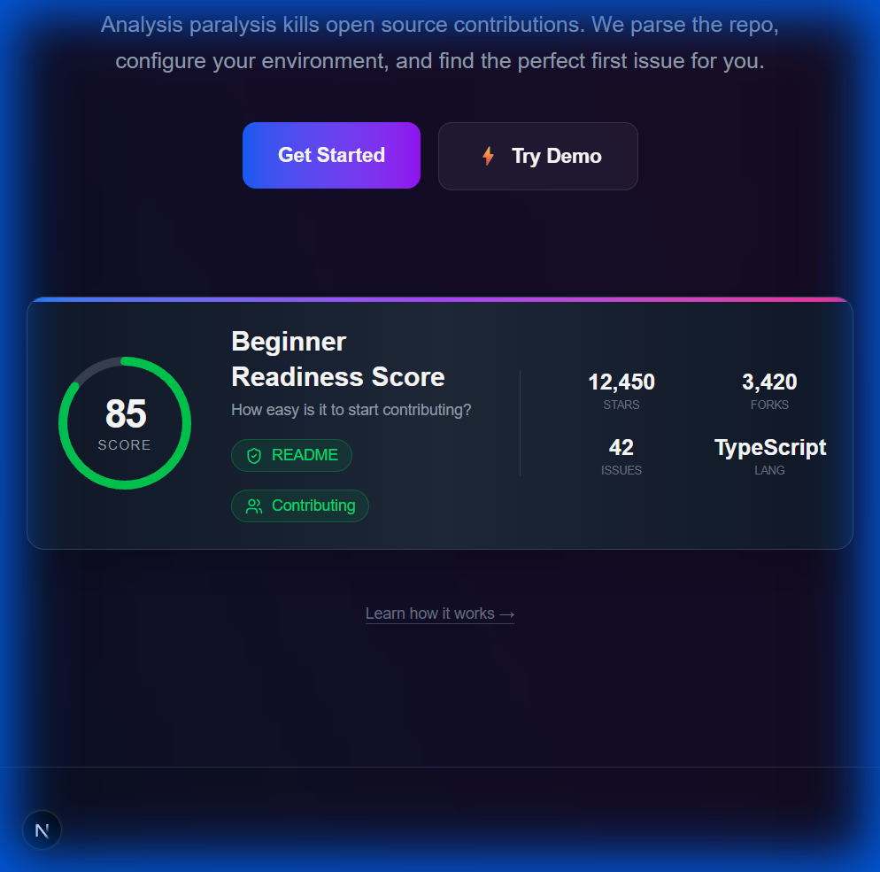
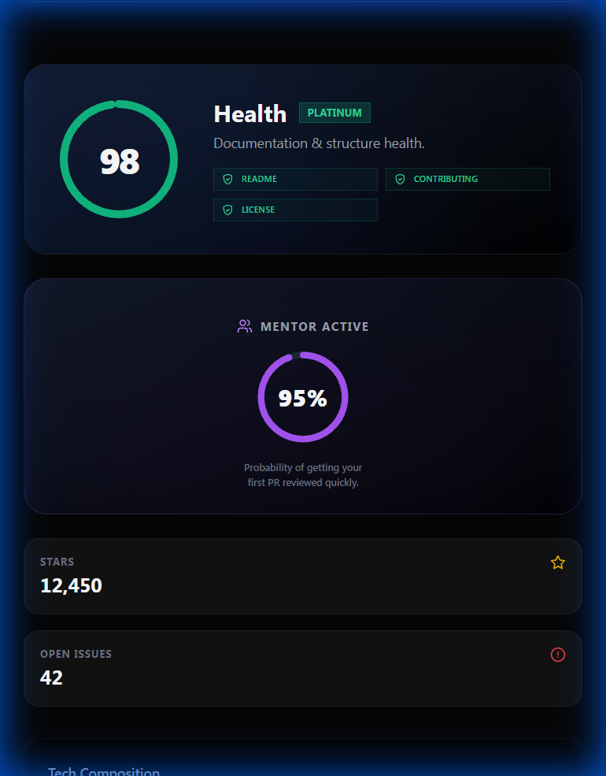

<div id="top"></div>

## 👇🏻 Click the below image to watch the OnBoardHub Demo video 


[](https://youtu.be/XQZ24-VpUTs)

<div align="center">

# OnboardHub 🚀
<p>
  <em>
> **Built for Winter Of Code 5.0**  <br>
> *"Stop Staring at CONTRIBUTING.md. Start Coding."*

**OnboardHub** is a data-driven bridge for open-source beginners. It eliminates "Analysis Paralysis" by parsing complex repositories and providing a personalized, step-by-step roadmap to your first Pull Request.
 </em>
</p>
</div>

## 🌟 The Problem
Contributing to open source is terrifying for beginners.
- **Overwhelming Codebases**: Thousands of files with no clear entry point.
- **Complex Setup**: "npm install" rarely works the first time.
- **Fear of Judgment**: Am I picking an issue that's too hard?

## 💡 The Solution
OnboardHub acts as your **Senior Developer Buddy**. It scans any GitHub repository URL and generates:
1.  **Beginner Readiness Score**: A 0-100 rating of how friendly the repo is (based on docs, activity, and issue labeling).
2.  **First PR Assistant**: Exact, copy-paste terminal commands to clone, install, and branch.
3.  **Good First Issue Finder**: Filters issues by "Beginner", "Intermediate", and "Pro" complexity using keyword analysis.

---

## ✨ Key Features

### 1. Beginner Readiness Score 🛡️
Don't waste time on dead repos. We analyze:
- **Community Health**: Are maintainers active?
- **Doc Quality**: Does a README and CONTRIBUTING.md exist?
- **Issue Labels**: Are there "good first issues"?

### 2. The "First PR Assistant" 💻
We don't just tell you *what* to do; we give you the code.
- Auto-generates `git clone`, `cd`, and `npm install` commands.
- Provides a "Copy to Clipboard" workflow for instant setup.

### 3. Smart Issue Matching 🎯
Filter issues by your actual confidence level.
- **🌱 Beginner**: Typo fixes, documentation updates, simple UI tweaks.
- **🚀 Intermediate**: Logic changes, new components, API integration.
- **⚡ Pro**: Performance optimization, architectural refactors.

---

## 🛠️ Tech Stack

### Frontend
- **Framework**: Next.js 14 (App Router)
- **Styling**: Tailwind CSS + Custom Glassmorphism
- **Animations**: Framer Motion + Tailwind Animate
- **Icons**: Lucide React
- **Font**: Outfit (Google Fonts)

### Backend
- **Runtime**: Node.js
- **Framework**: Express.js
- **Analysis Engine**: Custom logic to parse GitHub API data
- **API**: GitHub REST API

---

## 🚀 Getting Started

We have simplified the startup process into a single script.

### Prerequisites
- Node.js installed (v18+)

### Installation

1.  **Clone the Repository**
    ```bash
    git clone https://github.com/soumyadeep/OnboardHub.git
    cd OnboardHub
    ```

2.  **Start the Application**
    Double-click `start_app.bat` OR run:
    ```bash
    .\start_app.bat
    ```
    *(This script automatically installs dependencies and launches both Frontend (:3000) and Backend (:5000))*

3.  **Open in Browser**
    Visit `http://localhost:3000`

---

## 📸 Screenshots

| Landing Page | Dashboard Analysis |
|:---:|:---:|
|  |  |

*(Note: The actual application features a dynamic glassmorphism UI)*

---

## 🤝 Contributing

We welcome contributions! Please see [CONTRIBUTING.md](CONTRIBUTING.md) for details.

## 📄 License

This project is licensed under the MIT License - see the [LICENSE](LICENSE) file for details.

---

**Made with ❤️ by Soumyadeep for Winter Of Code 5.0**
